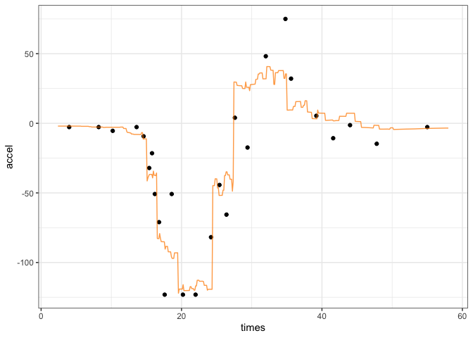

<!-- README.md is generated from README.Rmd. Please edit that file -->

# adjusted

<!-- badges: start -->

[](https://lifecycle.r-lib.org/articles/stages.html#experimental)
[](https://CRAN.R-project.org/package=adjusted)
[](https://github.com/topepo/adjusted/actions/workflows/R-CMD-check.yaml)
[](https://app.codecov.io/gh/topepo/adjusted?branch=main)
<!-- badges: end -->

The goal of adjusting is to make better predictions for regression
models by adjusting them using the most similar points from the training
set. We implement the method of [Quinlan
(1993)](https://scholar.google.com/scholar?hl=en&as_sdt=0%2C7&q=combining+instance%E2%80%93based+and+model%E2%80%93based+learning&btnG=)
and the [Gower
distance](https://scholar.google.com/scholar?hl=en&as_sdt=0%2C7&q=A+general+coefficient+of+similarity+and+some+of+its+properties&btnG=).

## Installation

You can install the development version of adjusted like so:

``` r
pak::pak("topepo/adjusted)
```

It is not on CRAN yet.

## Example

Let’s model the motorcycle helmet data in the `MASS` package with a
regression tree as an example. First, the data and the original CART
fit:

``` r
library(adjusted)
library(workflows)
library(dplyr)
library(parsnip)
library(ggplot2)
# Also required the rpart package to be installed

# Use the 1D motorcycle helmet data as an example

data(mcycle, package = "MASS")

# Use every fifth data point as a test point
in_test <- ( 1:nrow(mcycle) ) %% 5 == 0
cycl_train <- mcycle[-in_test, ]
cycl_test  <- mcycle[ in_test, ]

# A grid to show the predicted lines
mcycle_grid <- tibble(times = seq(2.4, 58, length.out = 500))
```

There is a nonlinear relationship between the predictor and outcome:

``` r
theme_set(theme_bw())

cycl_train %>%
  ggplot(aes(x = times)) +
  geom_point(aes(y = accel))
```


The CART fit is, as expected, blocky:

``` r
cart_spec <- decision_tree() %>% set_mode("regression")

cart_fit <- 
  workflow(accel ~ times, cart_spec) %>% 
  fit(data = cycl_train)

raw_pred <- augment(cart_fit, mcycle_grid)

raw_pred %>% 
  ggplot(aes(x = times)) + 
  geom_point(data = cycl_test, aes(y = accel)) +
  geom_line(aes(y = .pred),  col = "blue", alpha = 3 / 4)
```


The `nn_adjust()` function collects the information that it needs by
storing the fitted workflow as well as the training set:

``` r
adj_obj <- nn_adjust(cart_fit, cycl_train)
```

The `predict()` or `augment()` methods can be used to make the original
prediction along with the adjustment. The number of neighbors is
specified here:

``` r
adj_obj <- nn_adjust(cart_fit, cycl_train)
adj_pred <- augment(adj_obj, mcycle_grid, neighbors = 10)
head(adj_pred)
#> # A tibble: 6 × 2
#>   .pred times
#>   <dbl> <dbl>
#> 1 -1.99  2.4 
#> 2 -1.99  2.51
#> 3 -1.99  2.62
#> 4 -1.99  2.73
#> 5 -2.00  2.85
#> 6 -2.00  2.96
```

For the held out data, there are different predictions:

``` r
adj_pred %>% 
  ggplot(aes(x = times)) + 
  geom_point(data = cycl_test, aes(y = accel)) +
  geom_line(aes(y = .pred),  col = "darkorange", alpha = 3 / 4)
```



## Code of Conduct

Please note that the adjusted project is released with a [Contributor
Code of
Conduct](https://contributor-covenant.org/version/2/1/CODE_OF_CONDUCT.html).
By contributing to this project, you agree to abide by its terms.
